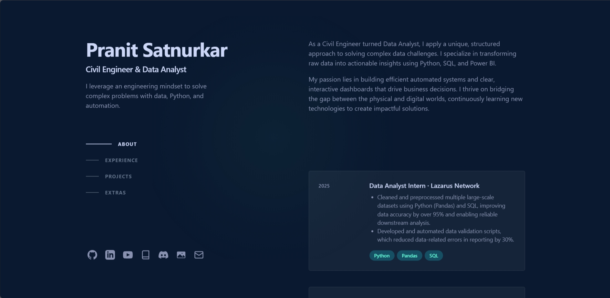

# Pranit Satnurkar's Portfolio

A personal portfolio website built with Python, Flask, and Tailwind CSS, inspired by a modern, single-page design.

View the live site: [pranitsatnurkar.com](https://portfolio-website-beta-two-64.vercel.app/) 

## 🔨 Built With

This project was built using a combination of modern web technologies:

* **Backend**:
    * [Python](https://www.python.org/) - The core programming language.
    * [Flask](https://flask.palletsprojects.com/) - A lightweight web framework for serving the site and data API.

* **Frontend**:
    * [Tailwind CSS](https://tailwindcss.com/) - For a utility-first CSS workflow.
    * [GSAP (GreenSock Animation Platform)](https://greensock.com/gsap/) - For smooth scrolling and animations.

* **Deployment**:
    * The site is ready to be deployed on platforms like Vercel, Netlify, or Heroku.